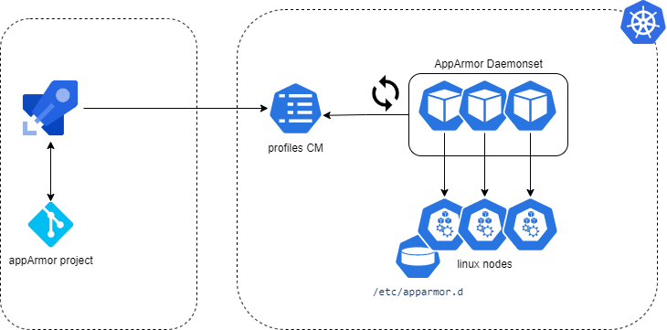

[](https://github.com/tuxerrante/kapparmor/actions/workflows/build-app.yml)
[](https://github.com/tuxerrante/kapparmor/actions/workflows/codeql.yml)

# Kapparmor
Apparmor-loader project to deploy profiles through a kubernetes daemonset.  

This work is heavily inspired by [kubernetes/apparmor-loader](https://github.com/kubernetes/kubernetes/tree/master/test/images/apparmor-loader).



1. Azure pipelines will
	- deploy a configmap in the security namespace containing all the profiles versioned in the current project
	- it will apply a daemonset on the linux nodes
2. The configmap will contain multiple apparmor profiles  
   -  The custom profiles HAVE to start with the same PROFILE_NAME_PREFIX, currently this defaults to "custom.". 
   - The name of the file should be the same as the name of the profile.
3. The configmap will be polled every POLL_TIME seconds to move them into PROFILES_DIR host path and then enable them.

## Prerequisites
[Set up a Microk8s environment](./docs/microk8s.md).

### How to initialize this project again
```sh
helm create kapparmor
sudo usermod -aG docker $USER

# Create mod files in root dir
go mod init github.com/tuxerrante/kapparmor
go mod init ./go/src/app/
```

### Test the app
```sh
# Build and run the container image
docker build --quiet -t test-kapparmor --build-arg POLL_TIME=60 --build-arg PROFILES_DIR=/app/profiles -f Dockerfile . &&\
  echo &&\
  docker run --rm -it --privileged \
  --mount type=bind,source='/sys/kernel/security',target='/sys/kernel/security'  \
  --mount type=bind,source='/etc',target='/etc'\
  test-kapparmor
```


# External useful links
- https://emn178.github.io/online-tools/sha256.html
- https://github.com/udhos/equalfile/blob/v0.3.0/equalfile.go
- https://github.com/kubernetes-sigs/security-profiles-operator/
- https://github.com/kubernetes/kubernetes/blob/master/test/images/apparmor-loader/loader.go
