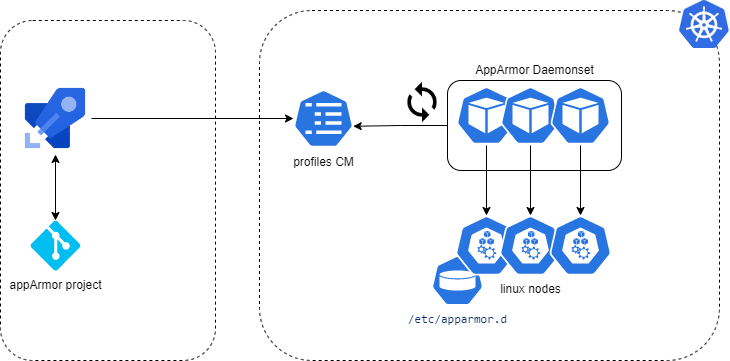

[](https://github.com/tuxerrante/kapparmor/actions/workflows/build-app.yml)
[](https://github.com/tuxerrante/kapparmor/actions/workflows/codeql.yml)
[](https://goreportcard.com/report/github.com/tuxerrante/kapparmor)
[](https://codecov.io/gh/tuxerrante/kapparmor)
[](https://www.bestpractices.dev/projects/8391)
[](https://securityscorecards.dev/viewer/?uri=github.com/tuxerrante/kapparmor)

---

#  Kapparmor

**Dynamic AppArmor Profile Management for Kubernetes**

Kapparmor is a **cloud-native security enforcer** that simplifies AppArmor profile management in Kubernetes clusters. Deploy, update, and manage AppArmor security profiles across your infrastructure through a simple ConfigMap interface—no manual node configuration required.



## Table of Contents

  - [Why AppArmor?](#why-apparmor)
    - [AppArmor vs SELinux vs Seccomp](#apparmor-vs-selinux-vs-seccomp)
  - [Key Features](#key-features)
  - [Security-First Approach](#security-first-approach)
  - [Getting Started](#getting-started)
    - [Prerequisites](#prerequisites)
    - [Installation](#installation)
      - [Via Helm (Recommended)](#via-helm-recommended)
      - [Via kubectl (Manual)](#via-kubectl-manual)
    - [Quick Start](#quick-start)
  - [Architecture](#architecture)
    - [How It Works](#how-it-works)
    - [Component Diagram](#component-diagram)
  - [Configuration](#configuration)
    - [Environment Variables / Helm Values](#environment-variables--helm-values)
    - [Helm Chart Values Example](#helm-chart-values-example)
  - [Constraints \& Limitations](#constraints--limitations)
  - [Testing](#testing)
  - [Documentation](#documentation)
    - [📚 Available Documentation](#-available-documentation)
    - [🔗 External References](#-external-references)
    - [📖 Learning Resources](#-learning-resources)
  - [Release Process](#release-process)
  - [Contributing](#contributing)
  - [Community \& Support](#community--support)
  - [License](#license)
  - [Credits \& Acknowledgments](#credits--acknowledgments)

---

## Overview

Kapparmor dynamically loads and unloads [AppArmor security profiles](https://ubuntu.com/server/docs/security-apparmor) on Kubernetes cluster nodes via ConfigMap. It runs as a privileged DaemonSet on Linux nodes, eliminating the need for manual profile management on each node.

**Key Capabilities:**
- 🔄 **Dynamic Loading** – Apply profile changes without node restarts
- 📦 **ConfigMap-Based** – Version control your security policies as Kubernetes manifests
- 🧹 **Auto-Cleanup** – Automatically remove unused profiles
- 🔍 **Change Detection** – Detects and syncs profile modifications
- ✅ **Validation** – Validates syntax before kernel loading
- 📊 **Observable** – Health endpoints and structured logging

This work was inspired by [kubernetes/apparmor-loader](https://github.com/kubernetes/kubernetes/tree/master/test/images/apparmor-loader).

---

## Why AppArmor?

### AppArmor vs SELinux vs Seccomp

| Feature                | **AppArmor**                          | SELinux                    | Seccomp                   |
| ---------------------- | ------------------------------------- | -------------------------- | ------------------------- |
| **Type**               | MAC (Mandatory Access Control)        | MAC                        | Syscall filtering         |
| **Scope**              | File access, capabilities, networking | File access, labels        | System calls only         |
| **Learning Curve**     | 🟢 Easy (plain-text profiles)          | 🔴 Steep (complex contexts) | 🟢 Simple (syscall lists)  |
| **Maintenance**        | 🟢 Low (profile-per-app)               | 🟡 Medium (policy system)   | 🟡 Medium (tool-dependent) |
| **Kubernetes Support** | ✅ Native via AppArmor                 | ✅ Via labels               | ✅ Native (RuntimeDefault) |
| **Use Case**           | Container workloads                   | Enterprise systems         | Syscall restriction       |

**Choose AppArmor when you need:**
- Easy-to-understand security profiles
- File and path-level access control
- Capability restrictions
- Port binding restrictions
- Network namespace access control

**Choose SELinux when you need:**
- Label-based context systems
- Enterprise policy frameworks (CIS profiles)
- Existing infrastructure investment

**Choose Seccomp when you need:**
- Only syscall filtering
- Lightweight containerized defaults
- Minimal overhead for simple restrictions

---

## Key Features

🔐 **Enterprise-Grade Security**
- Input validation with fuzz testing
- Secure coding practices (SSDLC)
- Supply chain security (signed commits, Harden-Runner, CodeQL)
- Zero external runtime dependencies

⚡ **Kubernetes-Native**
- DaemonSet-based deployment
- ConfigMap-driven configuration
- Health checks and readiness probes
- Optional Prometheus metrics

🛡️ **Robust Profile Management**
- Syntax validation before loading
- Filename/profile name consistency checks
- Path traversal protection
- Automatic cleanup of orphaned profiles

📈 **Production-Ready**
- Comprehensive test coverage
- CI/CD security gates
- OpenSSF Best Practices certified
- No privileged escalation vectors

---

## Security-First Approach

Kapparmor is built with security as a core principle:

✅ **Threat Modeling** – [Comprehensive STRIDE analysis](./docs/ThreatModel.md)  
✅ **Code Quality** – 80%+ test coverage, zero high-severity CodeQL alerts  
✅ **Supply Chain** – Pinned dependencies, signed commits, SBOM tracking  
✅ **Vulnerability Scanning** – Trivy, Gosec, Snyk integration  
✅ **Least Privilege** – Minimal RBAC, no elevated capabilities unless required  

👉 **[Read the full security threat model](./docs/ThreatModel.md)** for detailed analysis of risks and mitigations.

---

## Getting Started

### Prerequisites

**System Requirements:**
- Kubernetes 1.23+
- Ubuntu 22.04+ or similar Debian-based Linux nodes
- AppArmor enabled on all nodes:
  ```bash
  cat /sys/module/apparmor/parameters/enabled
  # Output should be: Y
  ```
- Helm 3.0+ (for easy installation)

**Verify AppArmor is enabled:**
```bash
# On each node
sudo aa-status

# Expected output shows: "X profiles loaded" and "X processes are in enforce/complain mode"
```

### Installation

#### Via Helm OCI (Recommended)

```bash
# Install directly from ghcr.io (no helm repo add needed)
helm upgrade kapparmor --install \
  --namespace kube-system \
  --atomic \
  --timeout 120s \
  oci://ghcr.io/tuxerrante/charts/kapparmor

# Or customize values
helm upgrade kapparmor --install \
  --namespace kube-system \
  --set image.tag=v1.0.0 \
  --set app.pollTime=30 \
  oci://ghcr.io/tuxerrante/charts/kapparmor --version 0.3.1
```

#### Via Helm Repository

```bash
# Add the Kapparmor Helm repository
helm repo add tuxerrante https://tuxerrante.github.io/kapparmor
helm repo update

# Install with defaults
helm upgrade kapparmor --install \
  --namespace kube-system \
  --atomic \
  --timeout 120s \
  tuxerrante/kapparmor
```

#### Via kubectl (Manual)

```bash
kubectl apply -f https://github.com/tuxerrante/kapparmor/releases/download/v1.0.0/kapparmor-manifest.yaml
```

### Quick Start

**1. Create an AppArmor profile ConfigMap:**

```yaml
apiVersion: v1
kind: ConfigMap
metadata:
  name: kapparmor-profiles
  namespace: kube-system
data:
  custom.deny-write-outside-home: |
    #include <tunables/global>
    
    profile custom.deny-write-outside-home flags=(attach_disconnected,mediate_deleted) {
      #include <abstractions/base>
      
      capability setuid,
      capability setgid,
      capability dac_override,
      
      /home/** rw,
      /tmp/** rw,
      /var/tmp/** rw,
      
      deny /etc/** w,
      deny /root/** w,
      deny / w,
    }
```

**2. Apply the ConfigMap:**

```bash
kubectl apply -f apparmor-profiles.yaml
```

**3. Deploy workload with the profile:**

```yaml
apiVersion: v1
kind: Pod
metadata:
  name: secure-app
  annotations:
    container.apparmor.security.beta.kubernetes.io/app: localhost/custom.deny-write-outside-home
spec:
  containers:
  - name: app
    image: ubuntu:24.04
    command: ["/bin/bash", "-c", "sleep infinity"]
```

**4. Verify profile was loaded:**

```bash
# Check on the node
sudo aa-status | grep custom.deny-write-outside-home

# Or from the pod
kubectl logs -n kube-system -l app=kapparmor | grep "Profile.*loaded"
```

---

## Architecture

### How It Works

1. **Polling** – Every `POLL_TIME` seconds (default: 30s), Kapparmor checks the `kapparmor-profiles` ConfigMap
2. **Comparison** – Identifies new, modified, or deleted profiles by comparing with local state
3. **Validation** – Validates profile syntax before kernel loading:
   - Profile name must start with `custom.`
   - Filename must match profile name
   - Must contain `profile` keyword and opening brace `{`
   - Path traversal checks on filename
4. **Loading** – Executes `apparmor_parser --replace <profile>` for new/updated profiles
5. **Unloading** – Executes `apparmor_parser --remove <profile>` for deleted profiles
6. **Cleanup** – Removes profile files from `/etc/apparmor.d/custom/`

### Component Diagram

```
┌──────────────────────────────────────┐
│   Kubernetes Control Plane           │
│  (ConfigMap: kapparmor-profiles)     │
└────────────┬─────────────────────────┘
             │
             │ (mount via volume)
             ▼
┌──────────────────────────────────────┐
│   Kapparmor DaemonSet Pod            │
│  ┌────────────────────────────────┐  │
│  │ Poll ConfigMap every 30s       │  │
│  │ Validate profiles              │  │
│  │ Copy to /etc/apparmor.d/custom │  │
│  │ Execute apparmor_parser        │  │
│  └────────────────────────────────┘  │
└────────────┬─────────────────────────┘
             │
             │ (apparmor_parser binary)
             ▼
┌──────────────────────────────────────┐
│   Host Linux Kernel                  │
│  (AppArmor module)                   │
│  /sys/kernel/security/apparmor/      │
└──────────────────────────────────────┘
```

---

## Configuration

### Environment Variables / Helm Values

| Parameter                 | Default                        | Description                           |
| ------------------------- | ------------------------------ | ------------------------------------- |
| `app.pollTime`            | `30`                           | Polling interval in seconds (1-86400) |
| `app.configmapPath`       | `/app/profiles`                | ConfigMap mount path                  |
| `app.profilesDir`         | `/etc/apparmor.d/custom`       | Host directory for profiles           |
| `image.repository`        | `ghcr.io/tuxerrante/kapparmor` | Container image                       |
| `image.tag`               | `latest`                       | Image tag/version                     |
| `resources.limits.cpu`    | `200m`                         | CPU limit per pod                     |
| `resources.limits.memory` | `128Mi`                        | Memory limit per pod                  |

### Helm Chart Values Example

```yaml
# values.yaml
app:
  pollTime: 30
  configmapPath: /app/profiles
  profilesDir: /etc/apparmor.d/custom
  logLevel: "INFO"

image:
  repository: ghcr.io/tuxerrante/kapparmor
  tag: "v1.0.0"
  pullPolicy: IfNotPresent

resources:
  limits:
    cpu: 200m
    memory: 128Mi
  requests:
    cpu: 100m
    memory: 64Mi

nodeSelector:
  kubernetes.io/os: linux
```

---

## Constraints & Limitations

⚠️ **Important:**

1. **Profile Naming** – Custom profiles MUST start with `custom.` prefix and match the filename
   ```
   ❌ BAD:  myprofile (missing prefix)
   ✅ GOOD: custom.myprofile (filename must also be custom.myprofile)
   ```

2. **Profile Syntax** – Profiles must be valid AppArmor syntax:
   ```
   ✅ REQUIRED: profile custom.name { ... }
   ❌ NOT SUPPORTED: hat name { ... } (nested profiles)
   ```

3. **Polling Interval** – Must be between 1 and 86400 seconds (24 hours)

4. **Node State** – Start on clean nodes (remove old orphaned profiles first)
   ```bash
   # Cleanup before initial deployment
   sudo rm -f /etc/apparmor.d/custom/*
   sudo systemctl reload apparmor
   ```

5. **Pod Dependencies** – Always delete pods using a profile before removing the profile from ConfigMap
   ```bash
   # BAD: This can crash Kapparmor
   kubectl delete configmap kapparmor-profiles

   # GOOD: Delete pods first
   kubectl delete pod -l app-profile=myprofile
   kubectl patch configmap kapparmor-profiles --type json -p='[{"op":"remove","path":"/data/custom.myprofile"}]'
   ```

---

## Testing

Comprehensive testing is documented in [docs/testing.md](docs/testing.md).

**Quick test:**
```bash
# Run Go tests
make test

# Run security checks
make lint

# Deploy to local MicroK8s cluster (if available)
./build/test_on_microk8s.sh
```

See the **[KAppArmor Demo project](https://github.com/tuxerrante/kapparmor-demo)** for practical examples.

---

## Documentation

### 📚 Available Documentation

| Document                                                                  | Purpose                                                                        |
| ------------------------------------------------------------------------- | ------------------------------------------------------------------------------ |
| **[ThreatModel.md](./docs/ThreatModel.md)**                               | Complete security threat model (STRIDE analysis, risk assessment, mitigations) |
| **[testing.md](./docs/testing.md)**                                       | Testing strategies and local cluster setup                                     |
| **[microk8s.md](./docs/microk8s.md)**                                     | MicroK8s-specific deployment guide                                             |
| **[kapparmor-architecture.drawio](./docs/kapparmor-architecture.drawio)** | Architecture diagrams (editable Drawio format)                                 |

### 🔗 External References

- **[Kubernetes AppArmor Tutorial](https://kubernetes.io/docs/tutorials/security/apparmor/)** – Official K8s guide
- **[AppArmor Documentation](https://ubuntu.com/server/docs/security-apparmor)** – Ubuntu reference
- **[AppArmor Profile Reference](https://gitlab.com/apparmor/apparmor/-/wikis/ProfileReference)** – Complete profile syntax
- **[AppArmor Profiles](https://documentation.suse.com/sles/15-SP1/html/SLES-all/cha-apparmor-profiles.html)** – SUSE documentation

### 📖 Learning Resources

- **AppArmor Profiles** are easier to learn than SELinux policies and more flexible than Seccomp
- Start with simple restrictive profiles (deny certain paths/capabilities)
- Use `complain` mode for testing before enabling `enforce` mode
- The included [sample profiles](./charts/kapparmor/profiles/) are good starting points

---

## Release Process

1. ✏️ Update `config/config` with new versions (app, chart, Go)
2. ✏️ Update `charts/kapparmor/Chart.yaml` with matching version
3. 🧪 Run unit and integration tests (see `Makefile`)
4. ✏️ Update `charts/kapparmor/CHANGELOG.md`
5. 📝 Open PR, get reviews
6. ✅ Merge to main
7. 🏷️ Create signed Git tag: `git tag -s v1.0.0`
8. 🚀 GitHub Actions automatically builds and publishes

**Note:** Commits must be signed (`git config commit.gpgsign true`)

---

## Contributing

Contributions are welcome! Please read [CONTRIBUTING.md](CONTRIBUTING.md) for:
- How to report bugs and request features
- How to set up a development environment
- Coding standards and testing requirements
- The pull request process

This project follows the [Contributor Covenant Code of Conduct](CODE_OF_CONDUCT.md).

For security vulnerabilities, see [SECURITY.md](SECURITY.md).

---

## Community & Support

- 🐛 **Found a bug?** [Open an issue](https://github.com/tuxerrante/kapparmor/issues)
- 💡 **Feature request?** [Start a discussion](https://github.com/tuxerrante/kapparmor/discussions)
- 📚 **Need help?** Check the [docs](./docs)
- 📋 **Changelog:** See [CHANGELOG.md](CHANGELOG.md) for release history

---

## License

This project is licensed under the [Apache 2.0 License](LICENSE).

---

## Credits & Acknowledgments

- 🎨 Logo design by [@Noblesix960](https://github.com/Noblesix960)
- 📝 Inspired by [kubernetes/apparmor-loader](https://github.com/kubernetes/kubernetes/tree/master/test/images/apparmor-loader)
- 🔐 Security guidance from Microsoft SDL and OWASP
- ☁️ Cloud-native architecture patterns from CNCF ecosystem

---

**Made with ❤️ for cloud-native security**
